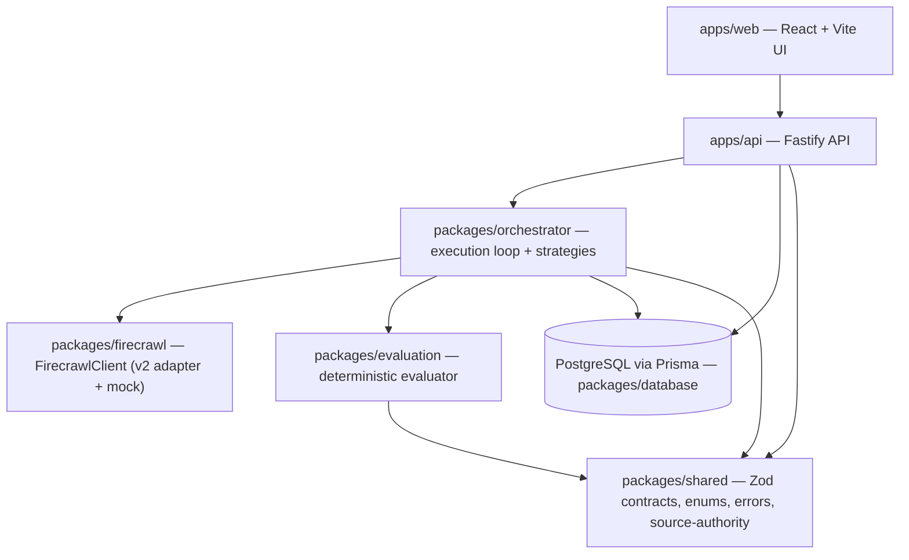
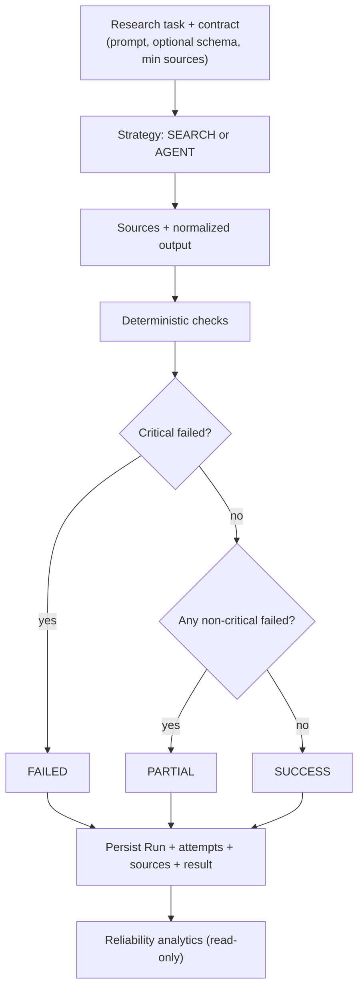
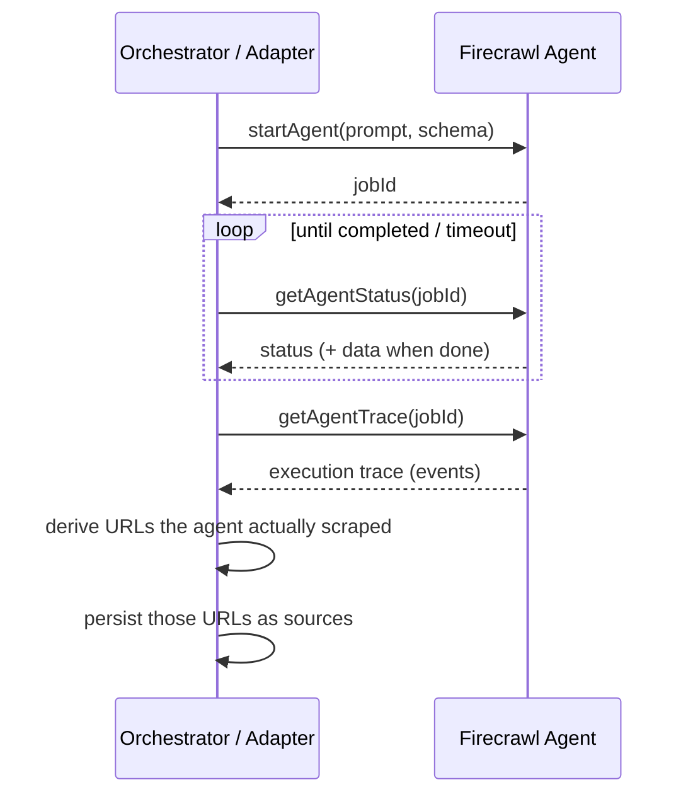
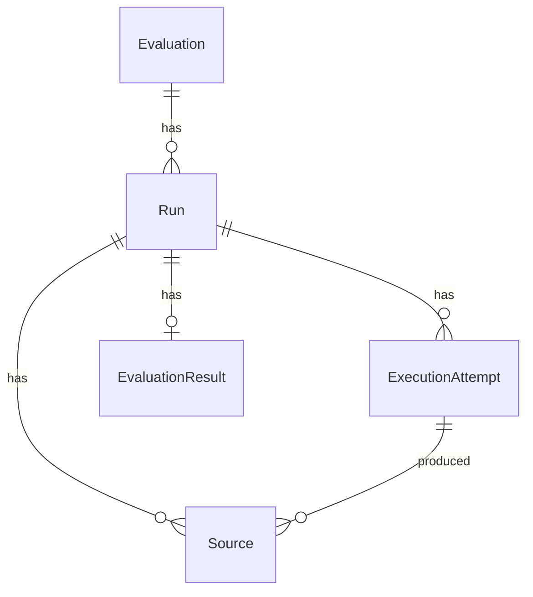
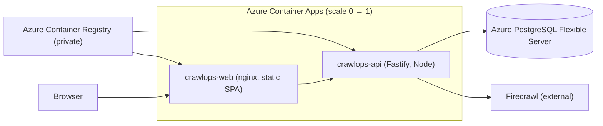

# CrawlOps — Architecture

CrawlOps executes web-research tasks with Firecrawl and evaluates how well each execution satisfied an explicit contract. Vendor- and infrastructure-specific concerns are isolated behind interfaces so the core evaluation logic stays portable and testable.

## 1. Component boundaries

- **`packages/shared`** — single source of truth for API contracts (Zod), enums, the failure taxonomy, structured logging, and the deterministic **source-authority** rules. Imported by both the API (validation) and the web app (types), so client and server cannot drift.
- **`packages/firecrawl`** — the only place the Firecrawl SDK is imported, behind a `FirecrawlClient` interface. A mock implements the same interface for tests, so unit tests never hit the paid API.
- **`packages/evaluation`** — a `EvaluatorProvider` interface with a deterministic implementation. No LLM required.
- **`packages/orchestrator`** — runs a strategy (SEARCH or AGENT) with bounded retries, persists attempts/sources, calls the evaluator, and writes the final run status.
- **`packages/database`** — Prisma schema and client.
- **`apps/api`** — Fastify routes, serializers, health/readiness, and an SSRF guard for user-supplied URLs.
- **`apps/web`** — the UI: evaluations, runs, run details, and reliability analytics.

## 2. Evaluation lifecycle

The orchestrator's `executeRun(runId)` loads the evaluation, runs the strategy with bounded retries, stores each attempt and its sources, evaluates the successful attempt, and writes the run's final status and (on failure) an `errorCategory`. Every step is logged with `runId` / `attemptId` trace context.

## 3. SEARCH flow

1. Call Firecrawl **search** for the task prompt (bounded number of results).
2. Normalize results into sources (URL, title, description, rank).
3. The "output" is the search/retrieval result shape.
4. Evaluate. A schema is optional for SEARCH; if a structured schema is supplied that the search shape cannot satisfy, schema validation fails with `INVALID_SCHEMA` — the contract was not met.

SEARCH is fast and uses fewer Firecrawl calls.

## 4. AGENT flow

AGENT performs structured, multi-source research using the Firecrawl Agent and requires an expected schema.

The final structured output is exactly what Firecrawl's agent returns — CrawlOps does not synthesize or fill fields.

## 5. How Agent provenance is captured

Provenance is derived from the agent's **execution trace**, not from output fields:

1. `startAgent` returns a `jobId`.
2. Poll `getAgentStatus(jobId)` until completed (or timeout).
3. `getAgentTrace(jobId)` returns the tool-call events.
4. Extract the URLs the agent **actually scraped** (from tool-call parameters), with a fallback to URLs surfaced in tool results.
5. Persist those URLs as the run's sources.

This is **run-level / fetched-page provenance**: it records which pages the agent fetched during the run. It is **not** claim-level citation mapping — CrawlOps does not assert which specific output field came from which specific page. A trace fetch failure is best-effort and never fails the run; it simply yields zero sources.

## 6. Deterministic evaluator

The evaluator runs a set of checks, each producing `{ id, label, passed, critical, detail }`. No LLM, no network, no cost.

| Check | Critical? |
| --- | --- |
| Completed within timeout | critical |
| Retrieved enough sources | critical |
| Produced a non-empty result | critical |
| Output matches expected schema (only when a schema is provided) | critical |
| All source URLs are valid | non-critical |
| No duplicate sources | non-critical |
| Used authoritative sources (≥ 1 PRIMARY) | non-critical |

`overallScore` is a documented heuristic (weighted pass ratio; critical checks weigh double) and is explicitly not an objective truth score.

**Example-shape normalization:** users often paste an *example object* rather than a JSON Schema. The evaluator converts an example into a strict schema (inferring `type` and requiring all keys) so validation is meaningful instead of vacuously passing.

## 7. SUCCESS / PARTIAL / FAILED semantics

- **FAILED** — at least one **critical** check failed (e.g. timeout, too few sources, empty output, schema mismatch).
- **PARTIAL** — all critical checks passed, but at least one **non-critical** quality check failed (e.g. duplicate sources, or no PRIMARY source).
- **SUCCESS** — all checks passed.

A critical failure always dominates: a schema mismatch stays FAILED even if other checks pass.

## 8. Persistence model (conceptual)

- **Evaluation** — the reusable contract: prompt, strategy, optional expected schema, caps (retries, Firecrawl calls, timeout, min sources).
- **Run** — one execution of an evaluation: status, strategy, duration, attempt count, optional `errorCategory`, normalized final output.
- **ExecutionAttempt** — a single try within a run (retries create multiple attempts), with its own status and failure category.
- **Source** — a retrieved source (URL, title, description, rank). Large scraped page content is offloaded via a `contentRef` pointer rather than stored inline.
- **EvaluationResult** — the deterministic checks, score, recommendation, and reasoning for a run.

## 9. Reliability analytics

Analytics are computed **only from already-persisted runs** — nothing is re-run. For one evaluation, a single bounded query (newest N runs, capped) yields success rate, average score, average duration, average sources, average primary-source share, failure categories, and run history. Loading analytics costs **zero Firecrawl and zero OpenAI calls**. The metrics are observational; CrawlOps does not claim statistical significance.

## 10. Source authority classification

All domain rules live in one module (`packages/shared/src/source-authority.ts`) so they are auditable and never scattered across the app. Classification is deterministic and URL/domain-based, in this precedence:

1. Unparsable / non-http(s) → `UNKNOWN`
2. Community/social platform → `COMMUNITY`
3. Government/academic suffix (`.gov`, `.edu`, `.gov.uk`, …) → `PRIMARY`
4. Recognized official/vendor domain (subdomains included, boundary-safe) → `PRIMARY`
5. Recognized news/publication/comparison site → `SECONDARY`
6. Everything else → `UNKNOWN`

Hostname matching is label-boundary-safe (`docs.github.com` → github.com PRIMARY; `evilgithub.com` → UNKNOWN). A documentation-style subdomain (`docs.`, `learn.`, `api.`) is **not** a PRIMARY signal on its own — it is PRIMARY only when its base domain is already recognized as official. This is a **provenance estimate, not a truth score**: PRIMARY does not mean correct, COMMUNITY does not mean wrong, UNKNOWN means not confidently classifiable.

## 11. Historical-run behavior

Source authority is **derived at read time** from the persisted `Source.url` values; it is never stored on the row. This has two deliberate consequences:

- **Old runs stay classifiable** with no migration or backfill — the Run Details view shows authority badges and the source-quality summary for any run, new or old.
- **Old evaluator results are not rewritten.** A run evaluated before the `source_authority` check existed keeps its original persisted check set and does not retroactively gain the new check. New runs include it.

## 12. Failure taxonomy

Every failure maps to a machine-readable category — `TIMEOUT`, `RATE_LIMIT`, `FIRECRAWL_ERROR`, `NO_RESULTS`, `INVALID_SCHEMA`, `INSUFFICIENT_SOURCES`, `PARSING_ERROR`, `EVALUATOR_FAILURE`, `NETWORK_FAILURE`, `AUTH_ERROR`, `UNKNOWN` — plus a human-readable message. This drives the failure breakdown in reliability analytics.

## 13. Observability

Structured JSON logging (pino) carries trace identifiers (`requestId`, `runId`, `attemptId`) so a single execution is traceable across the API, orchestrator, Firecrawl adapter, and evaluator.

## 14. Production topology

- `crawlops-web` and `crawlops-api` are separate images/containers; both scale to zero when idle.
- Images are pulled from a **private** ACR using a registry-scoped token.
- Liveness is `GET /api/health` (always 200); readiness is `GET /api/ready` (200 only when PostgreSQL is reachable).
- The database URL and Firecrawl key are Container App **secrets**, never baked into images.
- Deployments update the container **image only**, preserving probes, secrets, ingress, and scale settings.

## 15. Cost & security

- **Cost caps:** max Firecrawl calls per run, max search results, bounded retries, hard timeouts. Analytics and page loads make no Firecrawl/OpenAI calls.
- **Secrets:** read from env only; `.env` and `.env.azure` are gitignored; `.env.example` lists names/placeholders only.
- **SSRF:** user-supplied starting URLs are validated (http/https only) before use.
- **Tests:** unit tests use the Firecrawl mock and never call the paid API.
