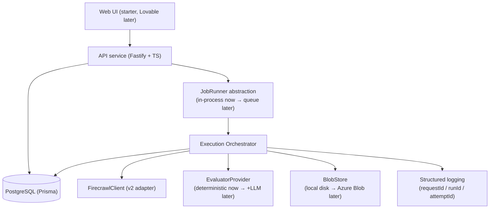

# CrawlOps — Architecture

## Overview

CrawlOps executes AI web-research tasks with Firecrawl and evaluates how well each execution worked. The design goal is a clean, cloud-neutral core loop with vendor-specific concerns isolated behind interfaces.

## The core loop

```
TASK → FIRECRAWL → RESULT → EVALUATION → DATABASE → READ RESULT BACK
```

## System diagram (MVP)



## Key design decisions

### Interfaces isolate vendors
- `FirecrawlClient` — the only place the `firecrawl` SDK is imported. A mock implements the same interface for tests.
- `EvaluatorProvider` — deterministic first; an OpenAI provider can be added without touching callers.
- `BlobStore` — large scraped artifacts are stored as files (local disk in dev) referenced by a pointer in Postgres; swaps to Azure Blob later. **Cloud note:** Container Apps' filesystem is ephemeral/per-replica, so `LocalBlobStore` is unsuitable for cloud persistence. The SEARCH MVP does not persist large content (only URLs/metadata in Postgres), so it does not rely on the filesystem; `AzureBlobStore` is deferred until SCRAPE/CRAWL need it (see `docs/DEPLOYMENT.md`).
- `JobRunner` — the seam where a real queue (Service Bus / Redis) replaces in-process execution.

### In-process orchestrator for the MVP
A separate worker requires a queue, which would make Redis a mandatory dependency. To honor "optional dependencies must not block the app," the orchestrator is an in-process package the API calls directly. It is written to be extracted into a worker later.

### Contracts live once
`packages/shared` holds Zod schemas that both the API (validation) and the web (types) consume, so the frontend and backend cannot drift.

## Failure taxonomy

Every failure maps to a machine-readable category (`TIMEOUT`, `RATE_LIMIT`, `FIRECRAWL_ERROR`, `NO_RESULTS`, `INVALID_SCHEMA`, `INSUFFICIENT_SOURCES`, `PARSING_ERROR`, `EVALUATOR_FAILURE`, `NETWORK_FAILURE`, `AUTH_ERROR`, `UNKNOWN`) plus a human-readable message. This powers the Failures page and reliability metrics.

## Observability

Structured JSON logging (pino) with trace identifiers (`requestId`, `runId`, `attemptId`) so a single execution is traceable across the API, orchestrator, Firecrawl adapter, and evaluator.

## Cost & security

- **Cost caps:** max Firecrawl calls per run, max search results, bounded retries, hard timeouts, no auto-running suites. Configurable via env.
- **Secrets:** read from env only, never committed, never sent to the browser. `.env` is gitignored; `.env.example` lists names only.
- **SSRF:** user-supplied URLs are validated (http/https only, private/link-local/metadata ranges blocked) before any scrape/crawl. *(planned — enforced in `packages/firecrawl`)*
- **Tests:** never call the paid Firecrawl API; the mock client is used. Real integration tests require explicit opt-in.

## Status

| Component | State |
| --- | --- |
| `packages/shared` (contracts, errors, logging, config) | implemented |
| `packages/firecrawl` (adapter, mock, error mapping) | tested against real Firecrawl API |
| `packages/database` (Prisma, client, BlobStore) | tested with local PostgreSQL |
| `packages/evaluation` (deterministic evaluator) | implemented, unit-tested |
| `packages/orchestrator` (loop, retries, strategies) | tested locally end-to-end |
| `apps/api` (Fastify, SSRF guard, health) | tested locally end-to-end |
| `apps/web` (typed client, hooks, pages) | tested locally against real API |

### End-to-end verification

The full loop has been executed locally against the real Firecrawl API and a
local PostgreSQL container. A SEARCH task returned 3 real sources in ~835 ms,
passed 5/5 deterministic checks (score 100%), and persisted a Run +
ExecutionAttempt + Source rows + EvaluationResult that the API and frontend read
back identically. The FAILED path (schema mismatch → `INVALID_SCHEMA`) was also
verified with real data.
